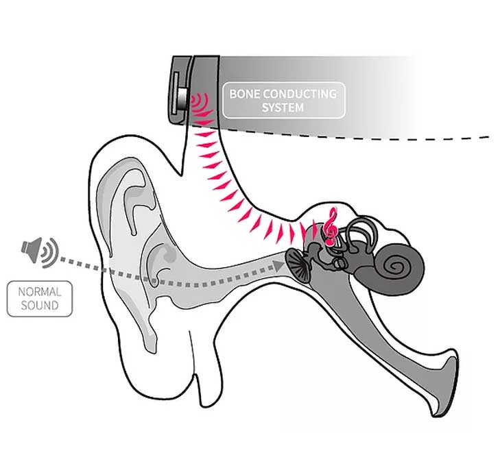
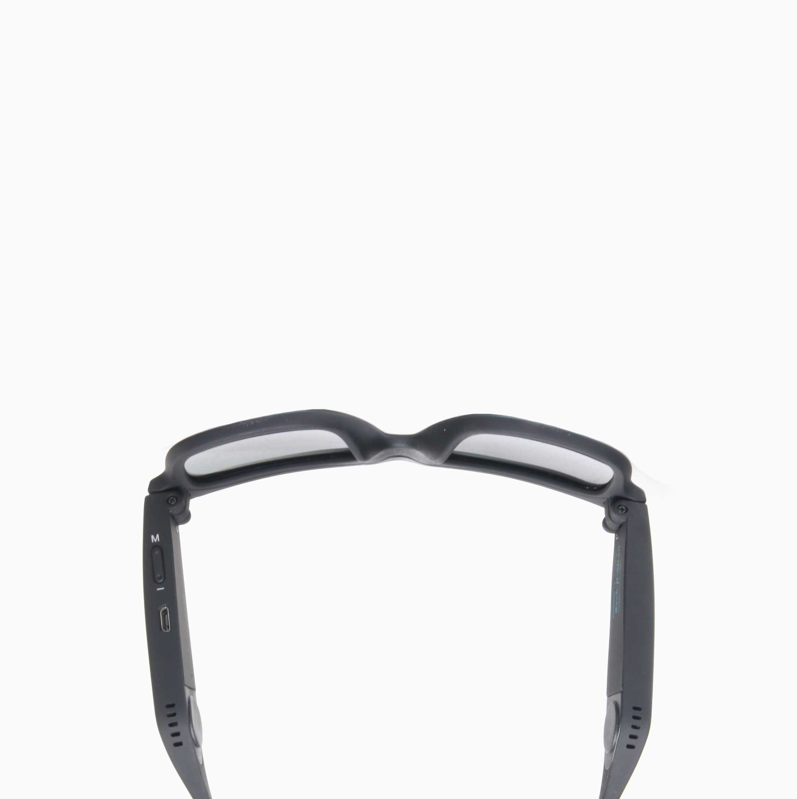

# cool_shades
<!doctype html>
<html lang="en">
  <head>
    <!-- Required meta tags -->
    <meta charset="utf-8">
    <meta name="viewport" content="width=device-width, initial-scale=1, shrink-to-fit=no">

    <!-- Bootstrap CSS -->
    <link rel="stylesheet" href="https://stackpath.bootstrapcdn.com/bootstrap/4.3.1/css/bootstrap.min.css" integrity="sha384-ggOyR0iXCbMQv3Xipma34MD+dH/1fQ784/j6cY/iJTQUOhcWr7x9JvoRxT2MZw1T" crossorigin="anonymous">
    <link rel="stylesheet" href="style.css">

    <title>Rock'N Roll Stroll by Peppers</title>
  </head>

  <body>

    

        

          

            
          

          

          

        

            
            

              <nav class="navbar navbar-expand-lg">
    <a class="navbar-brand" href="#"</a>
    <button class="navbar-toggler" type="button" data-toggle="collapse" data-target="#navbarNav" aria-controls="navbarNav" aria-expanded="false" aria-label="Toggle navigation">
      
    </button>
    

      <ul class="navbar-nav ml-auto">
        <li class="nav-item active">
          <a class="nav-link" href="#"> (current)</a>
        </li>
        <li class="nav-item">
          <a class="nav-link" href="#"tabindex="-1"aria-disabled="true">Features</a>
        </li>
        <li class="nav-item">
          <a class="nav-link" href="#" tabindex="-1" aria-disabled="true">Support</a>
        </li>
        <li class="nav-item">
          <a class="nav-link disabled" href="#" tabindex="-1" aria-disabled="true">Shop</a>
        </li>
      </ul>
    

  </nav>

            

              

              <ul class="col-ml">
            <h1> Audio Sunglasses</h1>
          

          

            <ul class="col-ml">
            <h3> Hit the slopes or Ride your bike without earbuds</h3>
          

            

              

                <ul class="col-ml">
            <button type="button" class="btn btn-primary btn-peppers ">Shop Now</button>
          

        

              <git commit -m "fixed markup in the nav to match the mocks"
            

              

              

              

            

            

          

<!-- this the end -->

<h1> Hands free</h1>
<h2> Play music,answer call & turn navigation streaming thorugh your shades</h2>
<button type="button" class="btn btn-primary btn-peppers ">Explore Features</button>
  

  

    
  

  

  

  <!-- Itstagram-->

  

    

      
      

        
      

    

    

      
    

  

  

<!---over-->

  

    

      

        <section>

        <h1> Find Your Style</h1>
      

    </section>
    

  

<section>
	

		

			
			
Rock-N-Stroll

			<h3>Black</h3>
			
$99.00

			

				<a href="#" class="btn btn-danger btn-lg">Add to Cart</a>
			

		

    

			
			
Rock-N-Stroll

			<h3>Red</h3>
			
$99.00

			

				<a href="#" class="btn btn-danger btn-lg">Add to Cart</a>
			

		

    

      
      
Rock-N-Stroll

      <h3>Blue</h3>
      
$99.00

      

        <a href="#" class="btn btn-danger btn-lg">Add to Cart</a>
      

    

    

      
      
Rock-N-Stroll

      <h3>Blue</h3>
      
$99.00

      

        <a href="#" class="btn btn-danger btn-lg">Add to Cart</a>
      

    

    <!-- its over-->

      

      

      

      <h1> Bone conduction Audio</h1>
      <h4>Sounds are converted to vibrations and passed directly to the auditory nerve bones. </h4>
      <button type="button" class="btn btn-link">Learn More</button>
        

        

          
        

        

        

      

      <!--last-->
        <h1> FEATURES </h1>
        <!--last one-->
        

          

            <h3>Weight:50g</h3>
            <h3>Lens:UV400/Polarized FDA Certified</h3>
            <h3>BluetoothBluetooth 5.0 A2DP profile1.3/ HFP profile 1.7/HSP profile 1.2(Wireless Range:30 feet/10 meters)<h3>
            <h3>Compatibility:Any Device(Samrtphone,Computer,Tablet,ect.) has Bluetooth and communication functions built-in</h3>
            <h3>Battery:115mAh Lithium Polymer Stand-by time: 100 hours Play time:4 hours (Set Volume level 10 at iOS 12)</h3>
            <h3>Charging time:Less than 1 hour by exclusive charging cable</h3>
            
          

